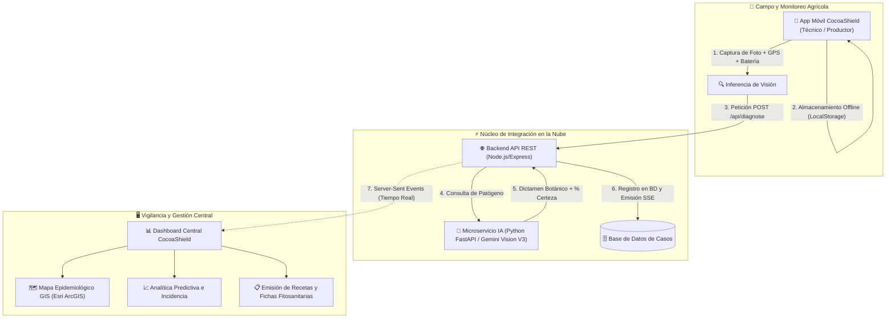

# 🍫 CocoaShield — Monorepo

[](https://cocoashield-dashboard.vercel.app)
[](https://movil-chi.vercel.app)
[](https://cocoashield-backend.onrender.com/api/cases)
[](https://cocoashield-ai-service.onrender.com)
[](LICENSE)

**CocoaShield** es una plataforma integral de **Vigilancia Epidemiológica Fitosanitaria e Inteligencia Artificial** diseñada para la detección temprana, geolocalización y prescripción agronómica de enfermedades en el cultivo de cacao amazónico (*Theobroma cacao L.*).

El sistema diagnostica con alta precisión las tres patologías de mayor impacto económico en la cuenca amazónica:
* 🍄 **Monilia** (*Moniliophthora roreri*)
* 🌿 **Escoba de Bruja** (*Moniliophthora perniciosa*)
* 🟤 **Mazorca Negra** (*Phytophthora palmivora / megakarya*)
* 🟢 **Frutos Sanos** (Control)

---

## 🌐 Servicios Desplegados en Producción

| Componente | Rol | Tecnología | Enlace en Producción |
| :--- | :--- | :--- | :--- |
| **Dashboard Central** | Panel de Control GIS y Epidemiología | React 18, Vite, Leaflet, Recharts | [cocoashield-dashboard.vercel.app](https://cocoashield-dashboard.vercel.app) |
| **App Móvil de Campo** | Diagnóstico en tiempo real y offline | React 19, Vite, Capacitor, PWA | [movil-chi.vercel.app](https://movil-chi.vercel.app) |
| **API Backend** | Gestión de Casos, GPS y Eventos SSE | Node.js, Express, Base de Datos | [cocoashield-backend.onrender.com](https://cocoashield-backend.onrender.com/api/cases) |
| **Microservicio IA** | Inferencia de Visión Computacional | Python 3.11, FastAPI, Gemini Vision | [cocoashield-ai-service.onrender.com](https://cocoashield-ai-service.onrender.com) |

---

## 📐 Arquitectura del Sistema



---

## 📂 Estructura del Monorepo

```text
cocoashield/
├── apps/
│   ├── dashboard/          # Panel Web con Leaflet GIS, gráficos y Modo Oscuro
│   │   ├── src/
│   │   │   ├── components/ # GisMap, PrescriptionModal, Lightbox, etc.
│   │   │   └── App.jsx
│   │   └── package.json
│   │
│   └── movil/              # App móvil con visor de escaneo, login y perfil
│       ├── src/
│       │   ├── components/ # DiagnosisTab, HistoryTab, ConfigTab, MobileLoginPage
│       │   └── App.jsx
│       └── package.json
│
├── services/
│   ├── backend/            # Servidor Express, manejo de imágenes y base de datos
│   │   ├── server.js
│   │   ├── dbClient.js
│   │   └── package.json
│   │
│   └── ai-service/         # Microservicio de inferencia con Gemini Vision / PyTorch
│       ├── main.py
│       └── requirements.txt
│
├── .gitignore              # Exclusión estricta de datasets pesados, dist y secrets
├── package.json            # Monorepo root con scripts unificados
└── README.md               # Esta documentación
```

---

## 🚀 Guía de Instalación y Ejecución Local

### Prerrequisitos
* **Node.js** >= 18.x
* **Python** >= 3.10
* **Git**

### 1. Clonar el Monorepo
```bash
git clone https://github.com/Maickel69/cocoashield.git
cd cocoashield
```

### 2. Ejecutar la Aplicación Móvil
```bash
cd apps/movil
npm install
npm run dev
# Disponible en http://localhost:5173
```

### 3. Ejecutar el Dashboard Administrativo
```bash
cd apps/dashboard
npm install
npm run dev
# Disponible en http://localhost:5174
```

### 4. Ejecutar el Backend Central
```bash
cd services/backend
npm install
npm start
# API activa en http://localhost:4000
```

### 5. Ejecutar el Microservicio de IA
```bash
cd services/ai-service
python -m venv .venv
source .venv/bin/activate # En Windows: .venv\Scripts\activate
pip install -r requirements.txt
uvicorn main:app --reload --port 8000
# Documentación Swagger en http://localhost:8000/docs
```

---

## ☁️ Guía de Despliegue en la Nube (Vercel & Render)

Para conectar este monorepo a **Vercel** o **Render**, únicamente se configura el parámetro **`Root Directory`**:

### En Vercel:
1. **Para el Dashboard:**
   * **Root Directory:** `apps/dashboard`
   * **Build Command:** `npm run build`
   * **Output Directory:** `dist`
2. **Para la App Móvil:**
   * **Root Directory:** `apps/movil`
   * **Build Command:** `npm run build`
   * **Output Directory:** `dist`

### En Render:
1. **Para la API Backend:**
   * **Root Directory:** `services/backend`
   * **Build Command:** `npm install`
   * **Start Command:** `node server.js`
2. **Para el Microservicio IA:**
   * **Root Directory:** `services/ai-service`
   * **Build Command:** `pip install -r requirements.txt`
   * **Start Command:** `uvicorn main:app --host 0.0.0.0 --port 10000`

---

## 👥 Equipo de Desarrollo

* **Maickel (Dueño del Proyecto)** — UNAMAD
* **Maicol Alberto** — Desarrollo y Validaciones de Campo
* **rasoky2** — Desarrollo de Interfaz Móvil y Experiencia de Usuario

---

## 📄 Licencia

Este proyecto está bajo la Licencia **MIT**. Consulta el archivo `LICENSE` para más detalles.
